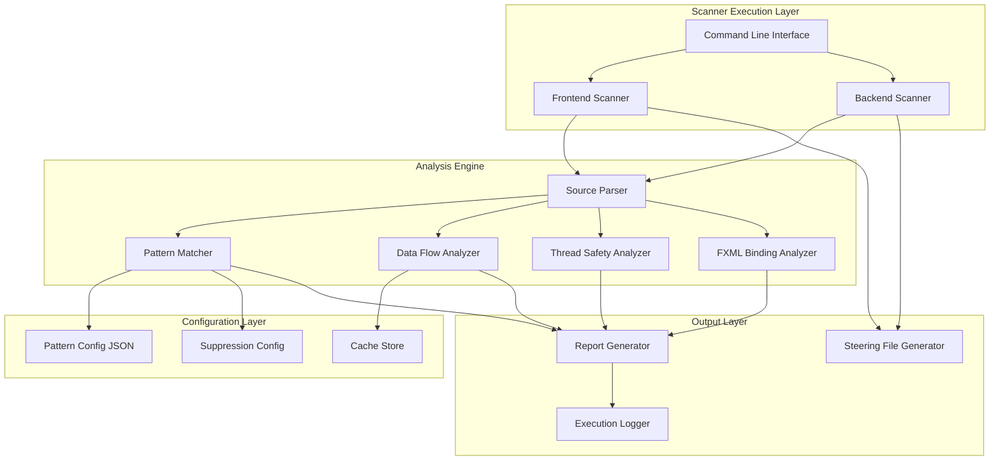

# Design Document: System Integrity Scanners

## Overview

The System Integrity Scanners solution provides automated quality assurance for the Barangay Data Management System (BDMS) through two specialized PowerShell analysis tools:

1. **Frontend Scanner** (`frontend-scanner.ps1`) - Analyzes `App.java` for UI/UX issues, JavaFX thread safety violations, FXML binding mismatches, and frontend integration problems
2. **Backend Scanner** (`backend-scanner.ps1`) - Analyzes `DatabaseHelper.java` for data integrity issues, SQL injection vulnerabilities, JDBC configuration problems, and backend reliability concerns

These scanners implement pattern-based static code analysis to detect 50+ issue types across five major categories: UI/UX, Backend/Data, Performance, Integration, and System Configuration. The solution generates detailed issue reports with severity classifications, suggested fixes, and steering documentation for maintaining verification standards.

### Design Goals

- **Comprehensive Coverage**: Detect all 50+ issue types specified in requirements across frontend and backend
- **Actionable Output**: Provide line numbers, severity levels, and concrete fix suggestions for every detected issue
- **Maintainability**: Use external JSON pattern libraries for easy extension without code changes
- **Integration-Ready**: Support command-line execution with exit codes for CI/CD pipeline integration
- **Developer-Friendly**: Support false positive suppression and incremental scanning for fast feedback loops

### Key Technical Challenges

1. **JavaFX-Specific Analysis**: Detecting `Platform.runLater()` violations requires understanding JavaFX threading model and identifying database/UI interactions
2. **FXML Binding Verification**: Requires parsing both Java source and XML FXML files to cross-reference `@FXML` annotations with `fx:id` attributes
3. **Data Flow Tracing**: Verifying UI-to-database consistency requires tracking field mappings across architectural layers
4. **Pattern Accuracy**: Balancing detection sensitivity to minimize false positives while catching genuine issues
5. **Performance**: Analyzing large source files efficiently while maintaining detailed line-level reporting

## Architecture

### System Components



### Component Responsibilities

#### 1. Command Line Interface (CLI)
- Parse command-line arguments (file paths, verbosity, output location, incremental mode)
- Validate input parameters and display usage help
- Orchestrate scanner execution flow
- Set exit codes based on scan results (0 for success, non-zero for errors)
- Display progress indicators during analysis

#### 2. Source Parser
- Read Java source files (App.java, DatabaseHelper.java)
- Tokenize source code into analyzable structures
- Extract method definitions, field declarations, annotations, and code blocks
- Parse FXML files to extract `fx:id` attributes and element types
- Build abstract syntax representation for pattern matching
- Track line numbers for all extracted elements

#### 3. Pattern Matcher
- Load pattern definitions from JSON configuration files
- Apply regex patterns to source code to detect issue signatures
- Match multi-line patterns for complex code structures
- Filter results based on suppression rules
- Classify matches by severity level
- Generate match metadata (line number, context, pattern name)

#### 4. Data Flow Analyzer
- Trace data movement from UI forms to database operations
- Map UI field names to database column names
- Identify validation rule locations in both layers
- Detect transformation logic between layers
- Verify bidirectional consistency (UI→DB and DB→UI)
- Build data flow graph for cross-layer verification

#### 5. Thread Safety Analyzer
- Identify database method calls in UI event handlers
- Detect UI updates from non-UI threads
- Verify `Platform.runLater()` wrapping for UI operations
- Identify long-running operations on UI thread
- Check `Task` and `Service` usage patterns
- Flag blocking operations in JavaFX Application Thread

#### 6. FXML Binding Analyzer
- Extract all `@FXML` annotated fields from App.java
- Parse referenced FXML files to extract `fx:id` attributes
- Cross-reference Java fields with FXML IDs
- Verify type compatibility between field declarations and FXML element types
- Detect orphaned fields (no matching FXML ID)
- Detect orphaned IDs (no matching Java field)

#### 7. Report Generator
- Aggregate issues from all analyzers
- Sort issues by severity and line number
- Format issues with clear descriptions and context
- Generate fix suggestions for each issue type
- Create summary statistics (issue counts by severity)
- Add metadata (timestamp, scanner version, file analyzed)
- Output in human-readable text format

#### 8. Steering File Generator
- Document expected behavior patterns on first execution
- Provide correct implementation examples
- List anti-patterns to avoid
- Generate markdown-formatted documentation
- Version steering files for change tracking

#### 9. Configuration Layer
- **Pattern Config JSON**: Stores pattern definitions with name, description, severity, and regex
- **Suppression Config**: Stores line numbers and reasons for suppressed issues
- **Cache Store**: Maintains previous scan results for incremental scanning

## Components and Interfaces

### Frontend Scanner (frontend-scanner.ps1)

**Purpose**: Analyze App.java for UI/UX issues, thread safety violations, and FXML binding problems.

**Input**:
- `App.java` source file path (default: `src/main/java/com/example/App.java`)
- Optional: FXML file directory path (default: `src/main/resources/com/example/`)
- Optional: Output report path (default: `frontend-scan-report.txt`)
- Optional: Verbosity level (`quiet`, `normal`, `verbose`)
- Optional: Incremental mode timestamp threshold

**Output**:
- Issue report text file
- Steering file (on first execution)
- Exit code (0 = success, 1 = critical errors found, 2 = execution error)

**Key Functions**:

```powershell
function Parse-JavaSource {
    param([string]$FilePath)
    # Returns: Hashtable with methods, fields, annotations, imports
}

function Detect-UIThreadViolations {
    param([hashtable]$ParsedSource)
    # Returns: Array of issues where DB calls lack Platform.runLater()
}

function Detect-FXMLBindingMismatches {
    param([hashtable]$ParsedSource, [string]$FXMLDirectory)
    # Returns: Array of issues for unmatched @FXML fields and fx:id attributes
}

function Detect-UIStateIssues {
    param([hashtable]$ParsedSource)
    # Returns: Array of issues for state management problems
}

function Detect-EventHandlerIssues {
    param([hashtable]$ParsedSource)
    # Returns: Array of issues for orphaned or broken event handlers
}

function Generate-IssueReport {
    param([array]$AllIssues, [string]$OutputPath)
    # Writes formatted report to file
}
```

### Backend Scanner (backend-scanner.ps1)

**Purpose**: Analyze DatabaseHelper.java for data integrity issues, SQL vulnerabilities, and JDBC configuration problems.

**Input**:
- `DatabaseHelper.java` source file path (default: `src/main/java/com/example/DatabaseHelper.java`)
- Optional: Output report path (default: `backend-scan-report.txt`)
- Optional: Verbosity level (`quiet`, `normal`, `verbose`)
- Optional: Incremental mode timestamp threshold

**Output**:
- Issue report text file
- Steering file (on first execution)
- Exit code (0 = success, 1 = critical errors found, 2 = execution error)

**Key Functions**:

```powershell
function Parse-JavaSource {
    param([string]$FilePath)
    # Returns: Hashtable with methods, fields, SQL queries, JDBC config
}

function Detect-SQLInjectionRisks {
    param([hashtable]$ParsedSource)
    # Returns: Array of issues for string concatenation in SQL queries
}

function Detect-JDBCConfigIssues {
    param([hashtable]$ParsedSource)
    # Returns: Array of issues for missing AUTO_SERVER, hardcoded credentials
}

function Detect-ValidationGaps {
    param([hashtable]$ParsedSource)
    # Returns: Array of issues for missing input validation before persistence
}

function Detect-ResourceLeaks {
    param([hashtable]$ParsedSource)
    # Returns: Array of issues for unclosed connections, statements, result sets
}

function Generate-IssueReport {
    param([array]$AllIssues, [string]$OutputPath)
    # Writes formatted report to file
}
```

### Pattern Configuration Schema

**File**: `frontend-patterns.json`, `backend-patterns.json`

```json
{
  "patterns": [
    {
      "id": "FE-001",
      "name": "UI Thread Blocking - Database Call",
      "category": "Performance",
      "severity": "Critical",
      "description": "Database method call in UI event handler without Platform.runLater()",
      "regex": "(?<!Platform\\.runLater\\(.*?)DatabaseHelper\\.[a-zA-Z]+\\(",
      "multiline": true,
      "context_lines": 5,
      "fix_suggestion": "Wrap database calls in Platform.runLater(() -> { ... }) or execute on background thread with Task/Service",
      "example_correct": "Platform.runLater(() -> {\n    List<Resident> residents = DatabaseHelper.getAllResidents();\n    residentTable.setItems(FXCollections.observableArrayList(residents));\n});"
    },
    {
      "id": "BE-001",
      "name": "SQL Injection Risk",
      "category": "Security",
      "severity": "Critical",
      "description": "SQL query constructed with string concatenation instead of prepared statements",
      "regex": "String\\s+\\w+\\s*=\\s*\"(SELECT|INSERT|UPDATE|DELETE).*?\"\\s*\\+",
      "multiline": false,
      "context_lines": 3,
      "fix_suggestion": "Use PreparedStatement with parameterized queries: PreparedStatement pstmt = conn.prepareStatement(\"SELECT * FROM users WHERE id = ?\"); pstmt.setInt(1, userId);",
      "example_correct": "String query = \"SELECT * FROM users WHERE username = ?\";\nPreparedStatement pstmt = conn.prepareStatement(query);\npstmt.setString(1, username);"
    }
  ]
}
```

### Suppression Configuration Schema

**File**: `scan-suppressions.json`

```json
{
  "suppressions": [
    {
      "file": "App.java",
      "line": 245,
      "pattern_id": "FE-001",
      "reason": "Intentional synchronous call for login validation - must block UI",
      "added_by": "developer@example.com",
      "added_date": "2024-01-15"
    }
  ]
}
```

### Issue Report Format

```
================================================================================
SYSTEM INTEGRITY SCAN REPORT - FRONTEND
================================================================================
Scan Date: 2024-01-20 14:30:45
Scanner Version: 1.0.0
File Analyzed: src/main/java/com/example/App.java
Scan Mode: Full
================================================================================

SUMMARY
--------
Total Issues Found: 12
  Critical: 2
  High: 4
  Medium: 5
  Low: 1

================================================================================
CRITICAL ISSUES (2)
================================================================================

[FE-001] UI Thread Blocking - Database Call
Line 342: handleAddResident()
Severity: Critical
Category: Performance

Issue:
  Database method call in UI event handler without Platform.runLater()
  
Code Context:
  340: private void handleAddResident() {
  341:     String firstName = firstNameField.getText();
> 342:     DatabaseHelper.addResident(firstName, lastName, birthDate);
  343:     residentTable.refresh();
  344: }

Fix Suggestion:
  Wrap database calls in Platform.runLater(() -> { ... }) or execute on 
  background thread with Task/Service

Example Correct Implementation:
  Platform.runLater(() -> {
      List<Resident> residents = DatabaseHelper.getAllResidents();
      residentTable.setItems(FXCollections.observableArrayList(residents));
  });

--------------------------------------------------------------------------------

[Additional issues follow same format...]

================================================================================
SUPPRESSED ISSUES (1)
================================================================================

[FE-001] UI Thread Blocking - Database Call
Line 245: handleLogin()
Reason: Intentional synchronous call for login validation - must block UI
Suppressed By: developer@example.com on 2024-01-15

================================================================================
END OF REPORT
================================================================================
```

## Data Models

### ParsedSource Structure

```powershell
@{
    FilePath = "src/main/java/com/example/App.java"
    LineCount = 2500
    Imports = @(
        @{ Line = 5; Package = "javafx.application.Platform" },
        @{ Line = 12; Package = "com.example.DatabaseHelper" }
    )
    Fields = @(
        @{ Line = 85; Name = "residentTable"; Type = "TableView<Resident>"; Annotations = @("@FXML") },
        @{ Line = 86; Name = "searchField"; Type = "TextField"; Annotations = @("@FXML") }
    )
    Methods = @(
        @{ 
            Line = 342
            Name = "handleAddResident"
            ReturnType = "void"
            Parameters = @()
            Body = "String firstName = firstNameField.getText();\nDatabaseHelper.addResident(...);"
            Annotations = @()
        }
    )
    FXMLReferences = @(
        @{ Line = 120; File = "main-view.fxml"; LoadMethod = "FXMLLoader.load()" }
    )
}
```

### Issue Structure

```powershell
@{
    ID = "FE-001"
    Name = "UI Thread Blocking - Database Call"
    Category = "Performance"
    Severity = "Critical"
    Line = 342
    Column = 5
    Method = "handleAddResident"
    Description = "Database method call in UI event handler without Platform.runLater()"
    CodeContext = @{
        Before = @("340: private void handleAddResident() {", "341:     String firstName = firstNameField.getText();")
        Flagged = "342:     DatabaseHelper.addResident(firstName, lastName, birthDate);"
        After = @("343:     residentTable.refresh();", "344: }")
    }
    FixSuggestion = "Wrap database calls in Platform.runLater(() -> { ... })"
    ExampleCorrect = "Platform.runLater(() -> { ... });"
    Suppressed = $false
    SuppressionReason = $null
}
```

### FXML Binding Map

```powershell
@{
    JavaFields = @(
        @{ Name = "residentTable"; Type = "TableView"; Line = 85; HasFXMLAnnotation = $true },
        @{ Name = "searchField"; Type = "TextField"; Line = 86; HasFXMLAnnotation = $true },
        @{ Name = "orphanedField"; Type = "Button"; Line = 90; HasFXMLAnnotation = $true }
    )
    FXMLElements = @(
        @{ ID = "residentTable"; Type = "TableView"; File = "main-view.fxml"; Line = 45 },
        @{ ID = "searchField"; Type = "TextField"; File = "main-view.fxml"; Line = 52 },
        @{ ID = "orphanedID"; Type = "Label"; File = "main-view.fxml"; Line = 60 }
    )
    Matched = @(
        @{ JavaField = "residentTable"; FXMLID = "residentTable"; TypeMatch = $true },
        @{ JavaField = "searchField"; FXMLID = "searchField"; TypeMatch = $true }
    )
    UnmatchedJavaFields = @(
        @{ Name = "orphanedField"; Type = "Button"; Line = 90 }
    )
    UnmatchedFXMLIDs = @(
        @{ ID = "orphanedID"; Type = "Label"; File = "main-view.fxml"; Line = 60 }
    )
}
```

### Data Flow Map

```powershell
@{
    UIToDatabase = @(
        @{
            UIField = "firstNameField"
            UIFieldType = "TextField"
            UILocation = "Line 342"
            DatabaseColumn = "first_name"
            DatabaseTable = "residents"
            DatabaseMethod = "addResident"
            DatabaseLocation = "DatabaseHelper.java:156"
            ValidationUI = "Line 340: if (firstName.isEmpty())"
            ValidationDB = "DatabaseHelper.java:158: NOT NULL constraint"
            ConsistencyCheck = "PASS"
        }
    )
    DatabaseToUI = @(
        @{
            DatabaseColumn = "first_name"
            DatabaseTable = "residents"
            DatabaseMethod = "getAllResidents"
            DatabaseLocation = "DatabaseHelper.java:245"
            UIField = "residentTable column"
            UIFieldType = "TableColumn"
            UILocation = "Line 450"
            DataTransformation = "None"
            ConsistencyCheck = "PASS"
        }
    )
    Mismatches = @(
        @{
            Issue = "UI allows empty middle_name but DB has NOT NULL constraint"
            UILocation = "Line 345"
            DatabaseLocation = "DatabaseHelper.java:52"
            Severity = "High"
        }
    )
}
```

## Algorithms

### Algorithm 1: UI Thread Safety Detection

**Purpose**: Identify database calls in UI event handlers that lack `Platform.runLater()` wrapping.

**Input**: ParsedSource hashtable from App.java

**Output**: Array of Issue objects for thread safety violations

**Steps**:

1. **Identify UI Event Handler Methods**
   - Search for methods with names matching patterns: `handle*`, `on*Click`, `on*Action`
   - Search for methods referenced in `setOnAction()`, `setOnMouseClicked()`, etc.
   - Mark these methods as "UI Thread Context"

2. **Identify Database Method Calls**
   - Search for calls to `DatabaseHelper.*` methods
   - Search for JDBC operations: `Connection`, `PreparedStatement`, `ResultSet`
   - Mark these calls with line numbers

3. **Check Platform.runLater() Wrapping**
   - For each database call in UI Thread Context:
     - Search backward from call line to method start
     - Look for `Platform.runLater(` or `new Task<>` or `new Service<>`
     - Check if database call is within lambda/anonymous class scope
     - If NOT wrapped, flag as violation

4. **Check Background Thread Execution**
   - For each database call in UI Thread Context:
     - Check if call is within `Task.call()` or `Service.createTask()`
     - Check if method is annotated with custom threading annotation
     - If on background thread, verify UI updates use `Platform.runLater()`

5. **Generate Issues**
   - For each violation:
     - Create Issue object with line number, method name, severity=Critical
     - Extract code context (5 lines before/after)
     - Add fix suggestion with correct Platform.runLater() usage
     - Add to issues array

**Pseudocode**:

```
function DetectUIThreadViolations(parsedSource):
    issues = []
    uiMethods = IdentifyUIEventHandlers(parsedSource.Methods)
    
    for method in uiMethods:
        dbCalls = FindDatabaseCalls(method.Body)
        
        for call in dbCalls:
            if not IsWrappedInPlatformRunLater(call, method):
                if not IsOnBackgroundThread(call, method):
                    issue = CreateIssue(
                        id="FE-001",
                        line=call.Line,
                        method=method.Name,
                        severity="Critical",
                        description="Database call without Platform.runLater()"
                    )
                    issues.append(issue)
    
    return issues
```

### Algorithm 2: FXML Binding Verification

**Purpose**: Cross-reference `@FXML` annotated fields in App.java with `fx:id` attributes in FXML files.

**Input**: 
- ParsedSource hashtable from App.java
- FXML file directory path

**Output**: Array of Issue objects for binding mismatches

**Steps**:

1. **Extract @FXML Fields from Java**
   - Parse App.java for field declarations
   - Filter fields with `@FXML` annotation
   - Store: field name, type, line number
   - Build JavaFields map

2. **Extract fx:id Attributes from FXML**
   - Find all FXML files referenced in App.java
   - Parse each FXML file as XML
   - Extract all elements with `fx:id` attribute
   - Store: ID value, element type, file name, line number
   - Build FXMLElements map

3. **Match Java Fields to FXML IDs**
   - For each JavaField:
     - Search FXMLElements for matching ID (case-sensitive)
     - If found, verify type compatibility (TextField → TextField, TableView → TableView)
     - Mark as matched
   - For each FXMLElement:
     - Search JavaFields for matching name
     - Mark as matched

4. **Identify Unmatched Elements**
   - JavaFields without FXML match → Orphaned Java fields (High severity)
   - FXMLElements without Java match → Orphaned FXML IDs (Medium severity)
   - Matched but type mismatch → Type incompatibility (Critical severity)

5. **Generate Issues**
   - For orphaned Java fields:
     - Issue: "@FXML field has no corresponding fx:id in FXML"
     - Suggestion: "Add fx:id=\"fieldName\" to FXML element or remove @FXML annotation"
   - For orphaned FXML IDs:
     - Issue: "fx:id in FXML has no corresponding @FXML field in controller"
     - Suggestion: "Add @FXML private Type fieldName; to controller"
   - For type mismatches:
     - Issue: "Type mismatch between @FXML field and FXML element"
     - Suggestion: "Change field type to match FXML element type"

**Pseudocode**:

```
function DetectFXMLBindingMismatches(parsedSource, fxmlDirectory):
    issues = []
    
    // Step 1: Extract Java fields
    javaFields = ExtractFXMLFields(parsedSource.Fields)
    
    // Step 2: Extract FXML IDs
    fxmlFiles = FindFXMLFiles(parsedSource.FXMLReferences, fxmlDirectory)
    fxmlElements = []
    for file in fxmlFiles:
        elements = ParseFXMLFile(file)
        fxmlElements.extend(elements)
    
    // Step 3: Match fields to IDs
    matched = []
    for field in javaFields:
        fxmlElement = FindMatchingFXMLElement(field.Name, fxmlElements)
        if fxmlElement:
            if TypesCompatible(field.Type, fxmlElement.Type):
                matched.append({field, fxmlElement})
            else:
                issues.append(CreateTypeMismatchIssue(field, fxmlElement))
    
    // Step 4: Identify unmatched
    unmatchedJavaFields = javaFields - matched.fields
    unmatchedFXMLElements = fxmlElements - matched.elements
    
    // Step 5: Generate issues
    for field in unmatchedJavaFields:
        issues.append(CreateOrphanedFieldIssue(field))
    
    for element in unmatchedFXMLElements:
        issues.append(CreateOrphanedIDIssue(element))
    
    return issues
```

### Algorithm 3: SQL Injection Detection

**Purpose**: Identify SQL queries constructed with string concatenation instead of prepared statements.

**Input**: ParsedSource hashtable from DatabaseHelper.java

**Output**: Array of Issue objects for SQL injection risks

**Steps**:

1. **Identify SQL Query Construction**
   - Search for String variables containing SQL keywords: SELECT, INSERT, UPDATE, DELETE
   - Mark line numbers where SQL strings are defined

2. **Check for String Concatenation**
   - For each SQL string:
     - Check if followed by `+` operator
     - Check if used in `String.format()` with variables
     - Check if contains `${variable}` interpolation
     - If any concatenation detected, flag as potential injection risk

3. **Verify Prepared Statement Usage**
   - For each flagged query:
     - Search forward for `PreparedStatement` usage
     - Check if query is passed to `conn.prepareStatement()`
     - Check if parameters are set with `pstmt.setString()`, `pstmt.setInt()`, etc.
     - If NOT using prepared statements, confirm as injection risk

4. **Check for Whitelisting/Sanitization**
   - For each confirmed risk:
     - Check if concatenated values are from enum/constant (safe)
     - Check if values are validated against whitelist
     - If no sanitization, mark as Critical severity

5. **Generate Issues**
   - For each injection risk:
     - Create Issue with line number, severity=Critical
     - Extract query construction code
     - Provide fix suggestion with PreparedStatement example
     - Show before/after code comparison

**Pseudocode**:

```
function DetectSQLInjectionRisks(parsedSource):
    issues = []
    
    // Step 1: Find SQL queries
    sqlQueries = FindSQLQueries(parsedSource.Methods)
    
    for query in sqlQueries:
        // Step 2: Check concatenation
        if HasStringConcatenation(query):
            // Step 3: Verify prepared statements
            if not UsesPreparedStatement(query):
                // Step 4: Check sanitization
                if not HasWhitelisting(query):
                    issue = CreateIssue(
                        id="BE-001",
                        line=query.Line,
                        severity="Critical",
                        description="SQL injection risk - string concatenation in query",
                        fixSuggestion="Use PreparedStatement with parameterized queries"
                    )
                    issues.append(issue)
    
    return issues
```

### Algorithm 4: Data Flow Consistency Verification

**Purpose**: Verify that UI form fields map correctly to database columns and validation rules are consistent.

**Input**: 
- ParsedSource from App.java (frontend)
- ParsedSource from DatabaseHelper.java (backend)

**Output**: Array of Issue objects for data flow inconsistencies

**Steps**:

1. **Build UI Field Map**
   - Extract all TextField, TextArea, ComboBox, DatePicker fields from App.java
   - Identify field names and types
   - Find validation logic for each field (isEmpty(), matches(), length checks)
   - Store in UIFieldMap

2. **Build Database Column Map**
   - Extract CREATE TABLE statements from DatabaseHelper.java
   - Parse column definitions: name, type, constraints (NOT NULL, UNIQUE, CHECK)
   - Store in DatabaseColumnMap

3. **Trace UI-to-Database Flow**
   - Find methods that read UI fields and call database insert/update methods
   - Map UI field names to database column names (e.g., firstNameField → first_name)
   - Record transformation logic (e.g., getText(), toLowerCase(), trim())
   - Store in UIToDatabaseFlow

4. **Trace Database-to-UI Flow**
   - Find methods that query database and populate UI elements
   - Map database columns to UI table columns or form fields
   - Record transformation logic (e.g., setItems(), setCellValueFactory())
   - Store in DatabaseToUIFlow

5. **Verify Consistency**
   - For each UI→DB mapping:
     - Check if UI validation matches DB constraints
       - UI allows empty but DB has NOT NULL → Mismatch
       - UI max length > DB column length → Mismatch
       - UI allows special chars but DB rejects them → Mismatch
     - Check if data types are compatible
       - UI TextField → DB INTEGER without parsing → Mismatch
   - For each DB→UI mapping:
     - Check if all DB columns are displayed in UI
     - Check if data transformations preserve information

6. **Generate Issues**
   - For each mismatch:
     - Create Issue with both UI and DB line numbers
     - Describe inconsistency clearly
     - Suggest fix (add UI validation or relax DB constraint)
     - Classify severity based on impact (data loss = Critical, UX issue = Medium)

**Pseudocode**:

```
function VerifyDataFlowConsistency(frontendSource, backendSource):
    issues = []
    
    // Step 1-2: Build maps
    uiFields = BuildUIFieldMap(frontendSource)
    dbColumns = BuildDatabaseColumnMap(backendSource)
    
    // Step 3-4: Trace flows
    uiToDbFlow = TraceUIToDatabaseFlow(frontendSource, backendSource)
    dbToUiFlow = TraceDatabaseToUIFlow(frontendSource, backendSource)
    
    // Step 5: Verify consistency
    for mapping in uiToDbFlow:
        uiField = uiFields[mapping.UIField]
        dbColumn = dbColumns[mapping.DatabaseColumn]
        
        // Check validation consistency
        if dbColumn.HasNotNullConstraint and not uiField.HasEmptyCheck:
            issues.append(CreateValidationMismatchIssue(uiField, dbColumn))
        
        if uiField.MaxLength > dbColumn.MaxLength:
            issues.append(CreateLengthMismatchIssue(uiField, dbColumn))
        
        // Check type compatibility
        if not TypesCompatible(uiField.Type, dbColumn.Type):
            issues.append(CreateTypeMismatchIssue(uiField, dbColumn))
    
    return issues
```

### Algorithm 5: Incremental Scanning

**Purpose**: Analyze only files modified since last scan for fast feedback during development.

**Input**:
- Source file path
- Timestamp threshold (files modified after this time)
- Cache file path (previous scan results)

**Output**: 
- Array of new/changed issues
- Indication of incremental vs full scan

**Steps**:

1. **Check File Modification Time**
   - Get last modified timestamp of source file
   - Compare with threshold timestamp
   - If file not modified, skip analysis and return cached results

2. **Load Previous Scan Results**
   - Read cache file containing previous issues
   - Parse into Issue objects with line numbers and IDs
   - Store in PreviousIssues array

3. **Perform Current Scan**
   - Run full analysis on modified file
   - Generate CurrentIssues array

4. **Compare Results**
   - For each issue in CurrentIssues:
     - Check if exists in PreviousIssues (match by ID and line number)
     - If not in previous, mark as "NEW"
     - If in previous but different, mark as "CHANGED"
   - For each issue in PreviousIssues:
     - If not in CurrentIssues, mark as "RESOLVED"

5. **Generate Incremental Report**
   - List NEW issues prominently
   - List RESOLVED issues
   - List CHANGED issues with before/after comparison
   - Include note: "Incremental scan - only modified files analyzed"

6. **Update Cache**
   - Write CurrentIssues to cache file
   - Include timestamp of scan

**Pseudocode**:

```
function IncrementalScan(filePath, thresholdTimestamp, cachePath):
    // Step 1: Check modification time
    fileModTime = GetFileModificationTime(filePath)
    if fileModTime < thresholdTimestamp:
        return LoadCachedResults(cachePath)
    
    // Step 2: Load previous results
    previousIssues = LoadCache(cachePath)
    
    // Step 3: Perform current scan
    currentIssues = PerformFullScan(filePath)
    
    // Step 4: Compare results
    newIssues = []
    resolvedIssues = []
    changedIssues = []
    
    for issue in currentIssues:
        prevIssue = FindMatchingIssue(issue, previousIssues)
        if not prevIssue:
            issue.Status = "NEW"
            newIssues.append(issue)
        else if issue != prevIssue:
            issue.Status = "CHANGED"
            changedIssues.append({issue, prevIssue})
    
    for prevIssue in previousIssues:
        if not FindMatchingIssue(prevIssue, currentIssues):
            prevIssue.Status = "RESOLVED"
            resolvedIssues.append(prevIssue)
    
    // Step 5: Generate report
    report = GenerateIncrementalReport(newIssues, resolvedIssues, changedIssues)
    
    // Step 6: Update cache
    SaveCache(cachePath, currentIssues, GetCurrentTimestamp())
    
    return report
```


## Error Handling

### Error Categories and Handling Strategies

#### 1. File Access Errors

**Scenarios**:
- Source file not found (App.java or DatabaseHelper.java missing)
- FXML files referenced but not accessible
- Insufficient permissions to read source files
- Output directory not writable

**Handling**:
- **Detection**: Check file existence before parsing with `Test-Path`
- **Response**: Display clear error message with file path and permission requirements
- **Exit Code**: 2 (execution error)
- **Logging**: Log full file path and error details to help diagnose path issues
- **Recovery**: Suggest checking file paths and permissions in error message

**Example Error Message**:
```
ERROR: Source file not found
  Path: src/main/java/com/example/App.java
  Current Directory: C:\Projects\BDMS
  
  Please verify:
  1. File exists at specified path
  2. Path is relative to project root
  3. You have read permissions for the file
  
  Exit code: 2
```

#### 2. Parse Errors

**Scenarios**:
- Malformed Java source code (syntax errors)
- Invalid FXML XML structure
- Unexpected code patterns that break parser
- Encoding issues (non-UTF-8 files)

**Handling**:
- **Detection**: Wrap parsing logic in try-catch blocks
- **Response**: Report parse error with line number if available
- **Fallback**: Continue with partial analysis if possible (skip unparseable sections)
- **Exit Code**: 2 (execution error) if parsing completely fails, 0 if partial analysis succeeds
- **Logging**: Log parse error details and problematic code section
- **Recovery**: Suggest checking source file for syntax errors

**Example Error Message**:
```
WARNING: Parse error in App.java at line 342
  Error: Unexpected token '}'
  Context: Unable to parse method body for handleAddResident()
  
  Impact: This method will be skipped in analysis
  Suggestion: Check source file for syntax errors and recompile
  
  Continuing with partial analysis...
```

#### 3. Pattern Configuration Errors

**Scenarios**:
- Pattern JSON file not found or malformed
- Invalid regex patterns that cause exceptions
- Missing required fields in pattern definitions
- Circular dependencies in pattern references

**Handling**:
- **Detection**: Validate JSON schema on load with `ConvertFrom-Json -ErrorAction Stop`
- **Response**: Display specific validation error (missing field, invalid regex)
- **Fallback**: Use built-in default patterns if external config fails
- **Exit Code**: 2 (execution error) if no patterns available, 1 (warning) if using fallback
- **Logging**: Log which patterns failed validation and why
- **Recovery**: Suggest fixing JSON syntax or regex patterns

**Example Error Message**:
```
ERROR: Invalid pattern configuration
  File: frontend-patterns.json
  Pattern ID: FE-001
  Field: regex
  Error: Invalid regex pattern - unmatched parenthesis
  
  Pattern: (?<!Platform\.runLater\(.*?DatabaseHelper\.[a-zA-Z]+\(
                                                                  ^
  Falling back to built-in default patterns...
```

#### 4. FXML Processing Errors

**Scenarios**:
- FXML file referenced in Java but not found
- FXML file is not valid XML
- FXML namespace issues
- Dynamic FXML loading that scanner cannot trace

**Handling**:
- **Detection**: Check FXML file existence and parse as XML
- **Response**: Report missing FXML files as Medium severity issues (not execution errors)
- **Fallback**: Skip FXML binding verification for missing files
- **Exit Code**: 0 (continue with other checks)
- **Logging**: Log which FXML files could not be processed
- **Recovery**: Note in report that FXML binding verification was incomplete

**Example Issue in Report**:
```
[FE-FXML-001] FXML File Not Found
Line 120: FXMLLoader.load(getClass().getResource("main-view.fxml"))
Severity: Medium
Category: Configuration

Issue:
  Referenced FXML file could not be found for binding verification
  
  Expected Path: src/main/resources/com/example/main-view.fxml
  
Fix Suggestion:
  Verify FXML file exists at expected location or update resource path
  
Note: FXML binding verification skipped for this file
```

#### 5. Memory and Performance Errors

**Scenarios**:
- Very large source files (>10MB) causing memory issues
- Regex patterns with catastrophic backtracking
- Infinite loops in data flow analysis
- Stack overflow from deeply nested code structures

**Handling**:
- **Detection**: Set timeouts for regex matching and analysis operations
- **Response**: Display warning about large file or complex analysis
- **Fallback**: Skip problematic patterns or limit analysis depth
- **Exit Code**: 0 (continue with partial results)
- **Logging**: Log performance warnings and skipped operations
- **Recovery**: Suggest breaking large files into smaller modules

**Example Warning Message**:
```
WARNING: Large file detected
  File: App.java
  Size: 15.2 MB
  Lines: 12,500
  
  Analysis may take several minutes...
  Consider breaking large files into smaller modules for better performance.
  
  Progress: [=====>    ] 50% complete
```

#### 6. Suppression Configuration Errors

**Scenarios**:
- Suppression file malformed or not valid JSON
- Suppression references non-existent line numbers
- Suppression references non-existent pattern IDs
- Conflicting suppressions

**Handling**:
- **Detection**: Validate suppression JSON schema on load
- **Response**: Warn about invalid suppressions but continue analysis
- **Fallback**: Ignore invalid suppressions, use valid ones
- **Exit Code**: 0 (warnings don't stop execution)
- **Logging**: Log which suppressions were invalid and why
- **Recovery**: Include warning in report about ignored suppressions

**Example Warning in Report**:
```
WARNING: Invalid Suppression Configuration
  File: scan-suppressions.json
  Suppression: Line 245, Pattern FE-999
  Error: Pattern ID 'FE-999' does not exist in pattern library
  
  This suppression will be ignored.
  Please update suppression file with valid pattern ID.
```

#### 7. Cache Errors (Incremental Scanning)

**Scenarios**:
- Cache file corrupted or not valid JSON
- Cache file from incompatible scanner version
- Cache file references deleted source files
- Disk full when writing cache

**Handling**:
- **Detection**: Validate cache JSON and version compatibility
- **Response**: Warn about cache issues and fall back to full scan
- **Fallback**: Perform full scan if cache is unusable
- **Exit Code**: 0 (cache issues don't stop execution)
- **Logging**: Log cache validation errors
- **Recovery**: Regenerate cache after successful full scan

**Example Warning Message**:
```
WARNING: Cache file invalid or incompatible
  File: .scan-cache.json
  Error: Cache version 0.9.0 incompatible with scanner version 1.0.0
  
  Performing full scan instead of incremental scan...
  Cache will be regenerated after scan completes.
```

### Error Handling Principles

1. **Fail Gracefully**: Never crash without a clear error message
2. **Partial Results**: Provide partial analysis results when possible rather than failing completely
3. **Clear Messages**: Error messages must include context, cause, and suggested fix
4. **Appropriate Exit Codes**: Use exit codes consistently (0=success, 1=issues found, 2=execution error)
5. **Logging**: Log all errors and warnings for debugging
6. **User Guidance**: Always suggest next steps for resolving errors

## Testing Strategy

### Testing Approach

The System Integrity Scanners feature requires **example-based testing** with concrete code samples rather than property-based testing. The scanners analyze specific code patterns in specific files, making them unsuitable for randomized property-based testing.

### Test Categories

#### 1. Unit Tests (PowerShell Pester Framework)

**Purpose**: Verify individual scanner functions work correctly with known inputs.

**Test Structure**:
```powershell
Describe "Parse-JavaSource" {
    It "Should extract method definitions from Java source" {
        $source = @"
public class Test {
    public void handleClick() {
        DatabaseHelper.addResident();
    }
}
"@
        $result = Parse-JavaSource -SourceCode $source
        $result.Methods.Count | Should -Be 1
        $result.Methods[0].Name | Should -Be "handleClick"
    }
    
    It "Should extract @FXML annotated fields" {
        $source = @"
public class Test {
    @FXML
    private TableView<Resident> residentTable;
}
"@
        $result = Parse-JavaSource -SourceCode $source
        $result.Fields.Count | Should -Be 1
        $result.Fields[0].Annotations | Should -Contain "@FXML"
    }
}
```

**Coverage Areas**:
- Source parsing functions (Java and FXML)
- Pattern matching functions
- Issue generation functions
- Report formatting functions
- Configuration loading functions
- Suppression handling functions

**Test Data**: Small, focused code snippets with known characteristics

#### 2. Integration Tests

**Purpose**: Verify scanner components work together correctly on realistic code samples.

**Test Structure**:
```powershell
Describe "Frontend Scanner Integration" {
    It "Should detect UI thread violations in sample code" {
        $testFile = "test-fixtures/app-with-thread-violation.java"
        $result = & ./frontend-scanner.ps1 -SourceFile $testFile -OutputFile "test-output.txt"
        
        $result.ExitCode | Should -Be 1  # Issues found
        $issues = Get-Content "test-output.txt" | ConvertFrom-Json
        $issues | Where-Object { $_.ID -eq "FE-001" } | Should -Not -BeNullOrEmpty
    }
    
    It "Should detect FXML binding mismatches" {
        $testJavaFile = "test-fixtures/app-with-orphaned-field.java"
        $testFXMLDir = "test-fixtures/fxml/"
        $result = & ./frontend-scanner.ps1 -SourceFile $testJavaFile -FXMLDirectory $testFXMLDir
        
        $issues = Get-Content "frontend-scan-report.txt" | ConvertFrom-Json
        $issues | Where-Object { $_.Name -like "*Orphaned*" } | Should -Not -BeNullOrEmpty
    }
}
```

**Coverage Areas**:
- End-to-end scanner execution
- Multi-file analysis (Java + FXML)
- Report generation
- Exit code correctness
- Configuration file loading

**Test Data**: Complete but minimal Java/FXML files with known issues

#### 3. Regression Tests

**Purpose**: Ensure scanner correctly identifies all 50+ issue types specified in requirements.

**Test Structure**:
```powershell
Describe "Frontend Scanner - All Issue Types" {
    BeforeAll {
        # Create test file with one instance of each issue type
        $testFile = "test-fixtures/comprehensive-issues.java"
    }
    
    It "Should detect UI thread blocking (FE-001)" {
        $issues = Get-ScanIssues $testFile
        $issues | Where-Object { $_.ID -eq "FE-001" } | Should -Not -BeNullOrEmpty
    }
    
    It "Should detect orphaned event handlers (FE-002)" {
        $issues = Get-ScanIssues $testFile
        $issues | Where-Object { $_.ID -eq "FE-002" } | Should -Not -BeNullOrEmpty
    }
    
    # ... one test for each of 50+ issue types
}
```

**Coverage Areas**:
- All 21 frontend issue types (Requirement 1)
- All 16 backend issue types (Requirement 2)
- All 5 performance issue types (Requirement 3)
- All 5 integration issue types (Requirement 4)
- All 5 system configuration issue types (Requirement 5)

**Test Data**: Comprehensive test file containing one instance of each issue type

#### 4. False Positive Tests

**Purpose**: Verify scanner does not flag correct code as problematic.

**Test Structure**:
```powershell
Describe "Frontend Scanner - False Positive Prevention" {
    It "Should not flag Platform.runLater wrapped database calls" {
        $source = @"
private void handleClick() {
    Platform.runLater(() -> {
        DatabaseHelper.addResident();
    });
}
"@
        $issues = Get-ScanIssues $source
        $issues | Where-Object { $_.ID -eq "FE-001" } | Should -BeNullOrEmpty
    }
    
    It "Should not flag prepared statements as SQL injection risks" {
        $source = @"
String query = "SELECT * FROM users WHERE id = ?";
PreparedStatement pstmt = conn.prepareStatement(query);
pstmt.setInt(1, userId);
"@
        $issues = Get-ScanIssues $source
        $issues | Where-Object { $_.ID -eq "BE-001" } | Should -BeNullOrEmpty
    }
}
```

**Coverage Areas**:
- Correct implementations that should not trigger warnings
- Edge cases where patterns might match incorrectly
- Suppression comment handling

**Test Data**: Correct code samples that follow best practices

#### 5. Error Handling Tests

**Purpose**: Verify scanner handles errors gracefully.

**Test Structure**:
```powershell
Describe "Frontend Scanner - Error Handling" {
    It "Should exit with code 2 when source file not found" {
        $result = & ./frontend-scanner.ps1 -SourceFile "nonexistent.java" 2>&1
        $LASTEXITCODE | Should -Be 2
        $result | Should -Match "ERROR.*not found"
    }
    
    It "Should continue with partial analysis on parse errors" {
        $testFile = "test-fixtures/malformed-syntax.java"
        $result = & ./frontend-scanner.ps1 -SourceFile $testFile
        $LASTEXITCODE | Should -Be 0  # Partial analysis succeeds
        $result | Should -Match "WARNING.*Parse error"
    }
    
    It "Should fall back to default patterns on config error" {
        Remove-Item "frontend-patterns.json" -ErrorAction SilentlyContinue
        $result = & ./frontend-scanner.ps1 -SourceFile "test-fixtures/simple.java"
        $result | Should -Match "Falling back to built-in default patterns"
    }
}
```

**Coverage Areas**:
- File not found errors
- Parse errors
- Configuration errors
- Permission errors
- Memory/performance errors

**Test Data**: Invalid files, missing files, malformed configurations

#### 6. Performance Tests

**Purpose**: Verify scanner performs efficiently on large files.

**Test Structure**:
```powershell
Describe "Frontend Scanner - Performance" {
    It "Should analyze 5000-line file in under 10 seconds" {
        $testFile = "test-fixtures/large-app.java"  # 5000 lines
        $stopwatch = [System.Diagnostics.Stopwatch]::StartNew()
        & ./frontend-scanner.ps1 -SourceFile $testFile
        $stopwatch.Stop()
        $stopwatch.Elapsed.TotalSeconds | Should -BeLessThan 10
    }
    
    It "Should handle 100 FXML files without memory issues" {
        $testJavaFile = "test-fixtures/app-many-fxml.java"
        $testFXMLDir = "test-fixtures/fxml-100/"  # 100 FXML files
        { & ./frontend-scanner.ps1 -SourceFile $testJavaFile -FXMLDirectory $testFXMLDir } | Should -Not -Throw
    }
}
```

**Coverage Areas**:
- Large file handling
- Many FXML files
- Complex regex patterns
- Memory usage

**Test Data**: Large generated files, many small files

#### 7. Incremental Scanning Tests

**Purpose**: Verify incremental scanning correctly identifies new/changed/resolved issues.

**Test Structure**:
```powershell
Describe "Frontend Scanner - Incremental Scanning" {
    It "Should skip analysis when file not modified" {
        $testFile = "test-fixtures/unchanged.java"
        $threshold = (Get-Date).AddHours(-1)
        $result = & ./frontend-scanner.ps1 -SourceFile $testFile -IncrementalThreshold $threshold
        $result | Should -Match "File not modified.*using cached results"
    }
    
    It "Should identify new issues since last scan" {
        $testFile = "test-fixtures/modified.java"
        # First scan
        & ./frontend-scanner.ps1 -SourceFile $testFile
        # Modify file to add new issue
        Add-Content $testFile "DatabaseHelper.addResident();"
        # Second scan
        $result = & ./frontend-scanner.ps1 -SourceFile $testFile -Incremental
        $result | Should -Match "NEW.*FE-001"
    }
}
```

**Coverage Areas**:
- Cache loading and saving
- Timestamp comparison
- Issue comparison (new/changed/resolved)
- Incremental report generation

**Test Data**: Files with known modification times, cached results

### Test Fixtures

**Directory Structure**:
```
test-fixtures/
├── app-with-thread-violation.java       # Contains FE-001 issue
├── app-with-orphaned-field.java         # Contains FXML binding issue
├── app-correct.java                     # No issues (false positive test)
├── database-with-sql-injection.java     # Contains BE-001 issue
├── database-correct.java                # No issues
├── comprehensive-issues.java            # Contains all 50+ issue types
├── malformed-syntax.java                # Parse error test
├── large-app.java                       # 5000+ lines for performance test
├── fxml/
│   ├── main-view.fxml                   # Matching FXML
│   ├── orphaned-ids.fxml                # Unmatched fx:id attributes
│   └── fxml-100/                        # 100 FXML files for stress test
├── patterns/
│   ├── valid-patterns.json              # Valid pattern config
│   ├── invalid-regex-patterns.json      # Invalid regex for error test
│   └── malformed.json                   # JSON syntax error
└── suppressions/
    ├── valid-suppressions.json          # Valid suppression config
    └── invalid-suppressions.json        # Invalid pattern IDs
```

### Test Execution

**Run All Tests**:
```powershell
Invoke-Pester -Path ./tests/ -Output Detailed
```

**Run Specific Test Suite**:
```powershell
Invoke-Pester -Path ./tests/frontend-scanner.tests.ps1
```

**Generate Coverage Report**:
```powershell
Invoke-Pester -Path ./tests/ -CodeCoverage ./frontend-scanner.ps1,./backend-scanner.ps1
```

### Continuous Integration

**CI Pipeline Steps**:
1. Install PowerShell and Pester framework
2. Run all unit tests
3. Run integration tests
4. Run regression tests (all 50+ issue types)
5. Run false positive tests
6. Run error handling tests
7. Generate coverage report (target: >80% coverage)
8. Fail build if any test fails

**Example GitHub Actions Workflow**:
```yaml
name: Scanner Tests
on: [push, pull_request]
jobs:
  test:
    runs-on: windows-latest
    steps:
      - uses: actions/checkout@v2
      - name: Install Pester
        run: Install-Module -Name Pester -Force -SkipPublisherCheck
      - name: Run Tests
        run: Invoke-Pester -Path ./tests/ -Output Detailed -CI
      - name: Upload Results
        uses: actions/upload-artifact@v2
        with:
          name: test-results
          path: testResults.xml
```

### Manual Testing Checklist

**Before Release**:
- [ ] Run scanners on actual BDMS codebase (App.java and DatabaseHelper.java)
- [ ] Verify all reported issues are genuine (no false positives)
- [ ] Verify known issues are detected (no false negatives)
- [ ] Test on Windows, Linux, and macOS (PowerShell Core)
- [ ] Test with different PowerShell versions (5.1, 7.x)
- [ ] Verify report formatting is readable
- [ ] Verify steering files are generated correctly
- [ ] Test incremental scanning with real file modifications
- [ ] Test suppression comments in actual code
- [ ] Verify exit codes are correct in all scenarios

### Test Maintenance

**When Adding New Issue Types**:
1. Add pattern definition to JSON config
2. Add unit test for pattern matching
3. Add test fixture with example of issue
4. Add regression test to verify detection
5. Add false positive test with correct implementation
6. Update comprehensive test file

**When Modifying Existing Patterns**:
1. Update pattern definition in JSON
2. Update corresponding unit tests
3. Verify regression tests still pass
4. Check for new false positives
5. Update test fixtures if needed


## Implementation Details

### PowerShell Script Structure

#### Frontend Scanner (frontend-scanner.ps1)

```powershell
#Requires -Version 5.1

<#
.SYNOPSIS
    Analyzes JavaFX frontend code (App.java) for UI/UX issues, thread safety violations, and FXML binding mismatches.

.DESCRIPTION
    The Frontend Scanner performs static code analysis on App.java to detect 21+ types of frontend issues including:
    - UI thread blocking from database calls
    - FXML binding mismatches between @FXML fields and fx:id attributes
    - Event handler issues
    - State management problems
    - Integration issues (CSV, PDF, QR, webcam)
    - File path portability issues

.PARAMETER SourceFile
    Path to App.java file (default: src/main/java/com/example/App.java)

.PARAMETER FXMLDirectory
    Path to directory containing FXML files (default: src/main/resources/com/example/)

.PARAMETER OutputFile
    Path for output report (default: frontend-scan-report.txt)

.PARAMETER Verbosity
    Output verbosity level: quiet, normal, verbose (default: normal)

.PARAMETER Incremental
    Enable incremental scanning (only analyze modified files)

.PARAMETER IncrementalThreshold
    Timestamp threshold for incremental scanning (DateTime)

.PARAMETER PatternConfig
    Path to pattern configuration JSON file (default: frontend-patterns.json)

.PARAMETER SuppressionConfig
    Path to suppression configuration JSON file (default: scan-suppressions.json)

.EXAMPLE
    .\frontend-scanner.ps1
    
.EXAMPLE
    .\frontend-scanner.ps1 -SourceFile "src/main/java/com/example/App.java" -Verbosity verbose

.EXAMPLE
    .\frontend-scanner.ps1 -Incremental -IncrementalThreshold (Get-Date).AddHours(-1)

.NOTES
    Version: 1.0.0
    Author: BDMS QA Team
    Exit Codes:
      0 = Success (no issues or only low/medium issues)
      1 = Critical or high severity issues found
      2 = Execution error (file not found, parse error, etc.)
#>

[CmdletBinding()]
param(
    [string]$SourceFile = "src/main/java/com/example/App.java",
    [string]$FXMLDirectory = "src/main/resources/com/example/",
    [string]$OutputFile = "frontend-scan-report.txt",
    [ValidateSet("quiet", "normal", "verbose")]
    [string]$Verbosity = "normal",
    [switch]$Incremental,
    [DateTime]$IncrementalThreshold,
    [string]$PatternConfig = "frontend-patterns.json",
    [string]$SuppressionConfig = "scan-suppressions.json"
)

# Script configuration
$ErrorActionPreference = "Stop"
$ScannerVersion = "1.0.0"
$CacheFile = ".frontend-scan-cache.json"

# Main execution flow
try {
    Write-Progress "Initializing Frontend Scanner v$ScannerVersion"
    
    # Step 1: Validate inputs
    if (-not (Test-Path $SourceFile)) {
        Write-Error "Source file not found: $SourceFile"
        exit 2
    }
    
    # Step 2: Check incremental mode
    if ($Incremental) {
        $fileModTime = (Get-Item $SourceFile).LastWriteTime
        if ($fileModTime -lt $IncrementalThreshold) {
            Write-Verbose "File not modified since threshold, using cached results"
            $cachedResults = Get-Content $CacheFile | ConvertFrom-Json
            Generate-Report -Issues $cachedResults -OutputPath $OutputFile
            exit 0
        }
    }
    
    # Step 3: Load configurations
    $patterns = Load-PatternConfig -Path $PatternConfig
    $suppressions = Load-SuppressionConfig -Path $SuppressionConfig
    
    # Step 4: Parse source file
    Write-Progress "Parsing source file..."
    $parsedSource = Parse-JavaSource -FilePath $SourceFile
    
    # Step 5: Run analyzers
    Write-Progress "Running analysis..."
    $allIssues = @()
    $allIssues += Detect-UIThreadViolations -ParsedSource $parsedSource -Patterns $patterns
    $allIssues += Detect-FXMLBindingMismatches -ParsedSource $parsedSource -FXMLDirectory $FXMLDirectory
    $allIssues += Detect-EventHandlerIssues -ParsedSource $parsedSource -Patterns $patterns
    $allIssues += Detect-FilePathIssues -ParsedSource $parsedSource -Patterns $patterns
    $allIssues += Detect-IntegrationIssues -ParsedSource $parsedSource -Patterns $patterns
    
    # Step 6: Apply suppressions
    $allIssues = Apply-Suppressions -Issues $allIssues -Suppressions $suppressions
    
    # Step 7: Generate report
    Write-Progress "Generating report..."
    Generate-Report -Issues $allIssues -OutputPath $OutputFile -ScannerVersion $ScannerVersion
    
    # Step 8: Update cache
    if ($Incremental) {
        Save-Cache -Issues $allIssues -CachePath $CacheFile
    }
    
    # Step 9: Generate steering file (first run only)
    if (-not (Test-Path "frontend-steering.md")) {
        Generate-SteeringFile -OutputPath "frontend-steering.md"
    }
    
    # Step 10: Determine exit code
    $criticalCount = ($allIssues | Where-Object { $_.Severity -eq "Critical" }).Count
    $highCount = ($allIssues | Where-Object { $_.Severity -eq "High" }).Count
    
    if ($criticalCount -gt 0 -or $highCount -gt 0) {
        Write-Host "Scan complete: $criticalCount critical, $highCount high severity issues found"
        exit 1
    } else {
        Write-Host "Scan complete: No critical or high severity issues found"
        exit 0
    }
    
} catch {
    Write-Error "Scanner execution error: $_"
    Write-Error $_.ScriptStackTrace
    exit 2
}
```

#### Backend Scanner (backend-scanner.ps1)

```powershell
#Requires -Version 5.1

<#
.SYNOPSIS
    Analyzes JavaFX backend code (DatabaseHelper.java) for data integrity issues, SQL vulnerabilities, and JDBC configuration problems.

.DESCRIPTION
    The Backend Scanner performs static code analysis on DatabaseHelper.java to detect 16+ types of backend issues including:
    - SQL injection vulnerabilities
    - JDBC connection configuration issues
    - Validation gaps
    - Resource leaks
    - Transaction handling issues
    - Data integrity problems

.PARAMETER SourceFile
    Path to DatabaseHelper.java file (default: src/main/java/com/example/DatabaseHelper.java)

.PARAMETER OutputFile
    Path for output report (default: backend-scan-report.txt)

.PARAMETER Verbosity
    Output verbosity level: quiet, normal, verbose (default: normal)

.PARAMETER Incremental
    Enable incremental scanning (only analyze modified files)

.PARAMETER IncrementalThreshold
    Timestamp threshold for incremental scanning (DateTime)

.PARAMETER PatternConfig
    Path to pattern configuration JSON file (default: backend-patterns.json)

.PARAMETER SuppressionConfig
    Path to suppression configuration JSON file (default: scan-suppressions.json)

.EXAMPLE
    .\backend-scanner.ps1
    
.EXAMPLE
    .\backend-scanner.ps1 -SourceFile "src/main/java/com/example/DatabaseHelper.java" -Verbosity verbose

.NOTES
    Version: 1.0.0
    Author: BDMS QA Team
    Exit Codes:
      0 = Success (no issues or only low/medium issues)
      1 = Critical or high severity issues found
      2 = Execution error (file not found, parse error, etc.)
#>

[CmdletBinding()]
param(
    [string]$SourceFile = "src/main/java/com/example/DatabaseHelper.java",
    [string]$OutputFile = "backend-scan-report.txt",
    [ValidateSet("quiet", "normal", "verbose")]
    [string]$Verbosity = "normal",
    [switch]$Incremental,
    [DateTime]$IncrementalThreshold,
    [string]$PatternConfig = "backend-patterns.json",
    [string]$SuppressionConfig = "scan-suppressions.json"
)

# Script configuration
$ErrorActionPreference = "Stop"
$ScannerVersion = "1.0.0"
$CacheFile = ".backend-scan-cache.json"

# Main execution flow
try {
    Write-Progress "Initializing Backend Scanner v$ScannerVersion"
    
    # Step 1: Validate inputs
    if (-not (Test-Path $SourceFile)) {
        Write-Error "Source file not found: $SourceFile"
        exit 2
    }
    
    # Step 2: Check incremental mode
    if ($Incremental) {
        $fileModTime = (Get-Item $SourceFile).LastWriteTime
        if ($fileModTime -lt $IncrementalThreshold) {
            Write-Verbose "File not modified since threshold, using cached results"
            $cachedResults = Get-Content $CacheFile | ConvertFrom-Json
            Generate-Report -Issues $cachedResults -OutputPath $OutputFile
            exit 0
        }
    }
    
    # Step 3: Load configurations
    $patterns = Load-PatternConfig -Path $PatternConfig
    $suppressions = Load-SuppressionConfig -Path $SuppressionConfig
    
    # Step 4: Parse source file
    Write-Progress "Parsing source file..."
    $parsedSource = Parse-JavaSource -FilePath $SourceFile
    
    # Step 5: Run analyzers
    Write-Progress "Running analysis..."
    $allIssues = @()
    $allIssues += Detect-SQLInjectionRisks -ParsedSource $parsedSource -Patterns $patterns
    $allIssues += Detect-JDBCConfigIssues -ParsedSource $parsedSource -Patterns $patterns
    $allIssues += Detect-ValidationGaps -ParsedSource $parsedSource -Patterns $patterns
    $allIssues += Detect-ResourceLeaks -ParsedSource $parsedSource -Patterns $patterns
    $allIssues += Detect-TransactionIssues -ParsedSource $parsedSource -Patterns $patterns
    
    # Step 6: Apply suppressions
    $allIssues = Apply-Suppressions -Issues $allIssues -Suppressions $suppressions
    
    # Step 7: Generate report
    Write-Progress "Generating report..."
    Generate-Report -Issues $allIssues -OutputPath $OutputFile -ScannerVersion $ScannerVersion
    
    # Step 8: Update cache
    if ($Incremental) {
        Save-Cache -Issues $allIssues -CachePath $CacheFile
    }
    
    # Step 9: Generate steering file (first run only)
    if (-not (Test-Path "backend-steering.md")) {
        Generate-SteeringFile -OutputPath "backend-steering.md"
    }
    
    # Step 10: Determine exit code
    $criticalCount = ($allIssues | Where-Object { $_.Severity -eq "Critical" }).Count
    $highCount = ($allIssues | Where-Object { $_.Severity -eq "High" }).Count
    
    if ($criticalCount -gt 0 -or $highCount -gt 0) {
        Write-Host "Scan complete: $criticalCount critical, $highCount high severity issues found"
        exit 1
    } else {
        Write-Host "Scan complete: No critical or high severity issues found"
        exit 0
    }
    
} catch {
    Write-Error "Scanner execution error: $_"
    Write-Error $_.ScriptStackTrace
    exit 2
}
```

### Key Implementation Functions

#### Parse-JavaSource Function

```powershell
function Parse-JavaSource {
    param(
        [Parameter(Mandatory=$true)]
        [string]$FilePath
    )
    
    $content = Get-Content $FilePath -Raw
    $lines = Get-Content $FilePath
    
    $result = @{
        FilePath = $FilePath
        LineCount = $lines.Count
        Imports = @()
        Fields = @()
        Methods = @()
        FXMLReferences = @()
    }
    
    # Parse imports
    $importPattern = '^\s*import\s+([\w.]+);'
    for ($i = 0; $i -lt $lines.Count; $i++) {
        if ($lines[$i] -match $importPattern) {
            $result.Imports += @{
                Line = $i + 1
                Package = $Matches[1]
            }
        }
    }
    
    # Parse fields with annotations
    $fieldPattern = '^\s*(@\w+\s+)*(?:private|public|protected)?\s+(\w+(?:<[\w<>,\s]+>)?)\s+(\w+)\s*[;=]'
    for ($i = 0; $i -lt $lines.Count; $i++) {
        if ($lines[$i] -match $fieldPattern) {
            $annotations = @()
            # Look backward for annotations
            for ($j = $i - 1; $j -ge 0 -and $lines[$j] -match '^\s*@(\w+)'; $j--) {
                $annotations += "@$($Matches[1])"
            }
            
            $result.Fields += @{
                Line = $i + 1
                Type = $Matches[2]
                Name = $Matches[3]
                Annotations = $annotations
            }
        }
    }
    
    # Parse methods
    $methodPattern = '^\s*(?:private|public|protected)?\s+(?:static\s+)?(\w+(?:<[\w<>,\s]+>)?)\s+(\w+)\s*\(([^)]*)\)\s*\{'
    for ($i = 0; $i -lt $lines.Count; $i++) {
        if ($lines[$i] -match $methodPattern) {
            # Extract method body (find matching closing brace)
            $braceCount = 1
            $bodyLines = @($lines[$i])
            for ($j = $i + 1; $j -lt $lines.Count -and $braceCount -gt 0; $j++) {
                $bodyLines += $lines[$j]
                $braceCount += ($lines[$j] -split '\{').Count - 1
                $braceCount -= ($lines[$j] -split '\}').Count - 1
            }
            
            $result.Methods += @{
                Line = $i + 1
                ReturnType = $Matches[1]
                Name = $Matches[2]
                Parameters = $Matches[3]
                Body = $bodyLines -join "`n"
            }
        }
    }
    
    # Parse FXML references
    $fxmlPattern = 'FXMLLoader\.load\([^)]*getResource\("([^"]+\.fxml)"\)'
    if ($content -match $fxmlPattern) {
        $result.FXMLReferences += @{
            Line = ($content.Substring(0, $Matches.Index) -split "`n").Count
            File = $Matches[1]
        }
    }
    
    return $result
}
```

#### Detect-UIThreadViolations Function

```powershell
function Detect-UIThreadViolations {
    param(
        [Parameter(Mandatory=$true)]
        [hashtable]$ParsedSource,
        [Parameter(Mandatory=$true)]
        [array]$Patterns
    )
    
    $issues = @()
    $threadViolationPattern = $Patterns | Where-Object { $_.id -eq "FE-001" }
    
    # Identify UI event handler methods
    $uiMethods = $ParsedSource.Methods | Where-Object {
        $_.Name -match '^(handle|on)\w+' -or
        $_.Body -match 'setOnAction|setOnMouseClicked|setOnKeyPressed'
    }
    
    foreach ($method in $uiMethods) {
        # Check for DatabaseHelper calls
        if ($method.Body -match 'DatabaseHelper\.(\w+)\(') {
            $dbMethodName = $Matches[1]
            
            # Check if wrapped in Platform.runLater
            $beforeCall = $method.Body.Substring(0, $method.Body.IndexOf("DatabaseHelper.$dbMethodName"))
            if ($beforeCall -notmatch 'Platform\.runLater\s*\(\s*\(\s*\)\s*->\s*\{') {
                # Check if in background thread (Task/Service)
                if ($beforeCall -notmatch 'new\s+Task<|new\s+Service<') {
                    # Extract line number within method
                    $methodLines = $method.Body -split "`n"
                    $callLineIndex = 0
                    for ($i = 0; $i -lt $methodLines.Count; $i++) {
                        if ($methodLines[$i] -match "DatabaseHelper\.$dbMethodName") {
                            $callLineIndex = $i
                            break
                        }
                    }
                    
                    $issues += @{
                        ID = "FE-001"
                        Name = "UI Thread Blocking - Database Call"
                        Category = "Performance"
                        Severity = "Critical"
                        Line = $method.Line + $callLineIndex
                        Method = $method.Name
                        Description = "Database method call in UI event handler without Platform.runLater()"
                        CodeContext = Get-CodeContext -Lines $methodLines -Index $callLineIndex
                        FixSuggestion = $threadViolationPattern.fix_suggestion
                        ExampleCorrect = $threadViolationPattern.example_correct
                        Suppressed = $false
                    }
                }
            }
        }
    }
    
    return $issues
}
```

#### Detect-FXMLBindingMismatches Function

```powershell
function Detect-FXMLBindingMismatches {
    param(
        [Parameter(Mandatory=$true)]
        [hashtable]$ParsedSource,
        [Parameter(Mandatory=$true)]
        [string]$FXMLDirectory
    )
    
    $issues = @()
    
    # Extract @FXML fields from Java
    $fxmlFields = $ParsedSource.Fields | Where-Object { $_.Annotations -contains "@FXML" }
    
    # Extract fx:id attributes from FXML files
    $fxmlElements = @()
    $fxmlFiles = Get-ChildItem -Path $FXMLDirectory -Filter "*.fxml" -ErrorAction SilentlyContinue
    
    foreach ($fxmlFile in $fxmlFiles) {
        try {
            [xml]$fxmlContent = Get-Content $fxmlFile.FullName
            $elementsWithId = $fxmlContent.SelectNodes("//*[@fx:id]")
            
            foreach ($element in $elementsWithId) {
                $fxmlElements += @{
                    ID = $element.GetAttribute("fx:id")
                    Type = $element.LocalName
                    File = $fxmlFile.Name
                    Line = $element.LineNumber
                }
            }
        } catch {
            Write-Warning "Failed to parse FXML file: $($fxmlFile.Name)"
        }
    }
    
    # Find unmatched Java fields
    foreach ($field in $fxmlFields) {
        $matchingElement = $fxmlElements | Where-Object { $_.ID -eq $field.Name }
        if (-not $matchingElement) {
            $issues += @{
                ID = "FE-FXML-001"
                Name = "Orphaned @FXML Field"
                Category = "Configuration"
                Severity = "High"
                Line = $field.Line
                Description = "@FXML field '$($field.Name)' has no corresponding fx:id in any FXML file"
                FixSuggestion = "Add fx:id=`"$($field.Name)`" to FXML element or remove @FXML annotation"
                Suppressed = $false
            }
        } elseif ($matchingElement.Type -ne $field.Type) {
            # Type mismatch
            $issues += @{
                ID = "FE-FXML-002"
                Name = "FXML Type Mismatch"
                Category = "Configuration"
                Severity = "Critical"
                Line = $field.Line
                Description = "Type mismatch: Java field '$($field.Name)' is $($field.Type) but FXML element is $($matchingElement.Type)"
                FixSuggestion = "Change field type to match FXML element type or update FXML element"
                Suppressed = $false
            }
        }
    }
    
    # Find unmatched FXML IDs
    foreach ($element in $fxmlElements) {
        $matchingField = $fxmlFields | Where-Object { $_.Name -eq $element.ID }
        if (-not $matchingField) {
            $issues += @{
                ID = "FE-FXML-003"
                Name = "Orphaned fx:id"
                Category = "Configuration"
                Severity = "Medium"
                File = $element.File
                Line = $element.Line
                Description = "fx:id '$($element.ID)' in $($element.File) has no corresponding @FXML field in controller"
                FixSuggestion = "Add @FXML private $($element.Type) $($element.ID); to controller"
                Suppressed = $false
            }
        }
    }
    
    return $issues
}
```

### Pattern Configuration Examples

#### Frontend Patterns (frontend-patterns.json)

```json
{
  "patterns": [
    {
      "id": "FE-001",
      "name": "UI Thread Blocking - Database Call",
      "category": "Performance",
      "severity": "Critical",
      "description": "Database method call in UI event handler without Platform.runLater()",
      "regex": "DatabaseHelper\\.[a-zA-Z]+\\(",
      "context_check": "Platform\\.runLater|new Task<|new Service<",
      "fix_suggestion": "Wrap database calls in Platform.runLater(() -> { ... }) or execute on background thread with Task/Service",
      "example_correct": "Platform.runLater(() -> {\n    List<Resident> residents = DatabaseHelper.getAllResidents();\n    residentTable.setItems(FXCollections.observableArrayList(residents));\n});"
    },
    {
      "id": "FE-002",
      "name": "Absolute File Path",
      "category": "Configuration",
      "severity": "High",
      "description": "Hardcoded absolute file path breaks portability",
      "regex": "(C:|D:|/home/|/Users/)[\\\\/][\\w\\\\/.-]+",
      "fix_suggestion": "Use getClass().getResource() for classpath resources or relative paths with Path.of()",
      "example_correct": "InputStream is = getClass().getResourceAsStream(\"/com/example/image.png\");"
    },
    {
      "id": "FE-003",
      "name": "Missing Form Clear After Submit",
      "category": "UI/UX",
      "severity": "Medium",
      "description": "Form fields not cleared after successful submission",
      "regex": "DatabaseHelper\\.(add|insert|create)\\w+\\([^)]+\\)",
      "context_check": "\\.clear\\(\\)|\\.setText\\(\"\"\\)",
      "fix_suggestion": "Clear all form fields after successful database operation",
      "example_correct": "DatabaseHelper.addResident(...);\nfirstNameField.clear();\nlastNameField.clear();"
    }
  ]
}
```

#### Backend Patterns (backend-patterns.json)

```json
{
  "patterns": [
    {
      "id": "BE-001",
      "name": "SQL Injection Risk",
      "category": "Security",
      "severity": "Critical",
      "description": "SQL query constructed with string concatenation instead of prepared statements",
      "regex": "String\\s+\\w+\\s*=\\s*\"(SELECT|INSERT|UPDATE|DELETE).*?\"\\s*\\+",
      "fix_suggestion": "Use PreparedStatement with parameterized queries",
      "example_correct": "String query = \"SELECT * FROM users WHERE username = ?\";\nPreparedStatement pstmt = conn.prepareStatement(query);\npstmt.setString(1, username);"
    },
    {
      "id": "BE-002",
      "name": "Missing AUTO_SERVER in H2 Connection",
      "category": "Configuration",
      "severity": "Medium",
      "description": "H2 JDBC connection string missing AUTO_SERVER=TRUE for shared access",
      "regex": "jdbc:h2:[^;\"]+(?!.*AUTO_SERVER)",
      "fix_suggestion": "Add AUTO_SERVER=TRUE to JDBC connection string for debugging support",
      "example_correct": "private static final String DB_URL = \"jdbc:h2:~/bdms;AUTO_SERVER=TRUE\";"
    },
    {
      "id": "BE-003",
      "name": "Hardcoded Database Credentials",
      "category": "Security",
      "severity": "Critical",
      "description": "Database credentials hardcoded in source code",
      "regex": "(USER|PASS|PASSWORD)\\s*=\\s*\"[^\"]+\"",
      "fix_suggestion": "Use environment variables or configuration files for credentials",
      "example_correct": "private static final String USER = System.getenv(\"DB_USER\");\nprivate static final String PASS = System.getenv(\"DB_PASS\");"
    },
    {
      "id": "BE-004",
      "name": "Resource Leak - Unclosed Connection",
      "category": "Performance",
      "severity": "High",
      "description": "Database connection not closed in finally block or try-with-resources",
      "regex": "Connection\\s+\\w+\\s*=\\s*getConnection\\(\\)",
      "context_check": "try\\s*\\([^)]*Connection|finally\\s*\\{[^}]*\\.close\\(\\)",
      "fix_suggestion": "Use try-with-resources or close connection in finally block",
      "example_correct": "try (Connection conn = getConnection()) {\n    // use connection\n}"
    }
  ]
}
```

### Deployment and Usage

#### Installation

1. **Prerequisites**:
   - PowerShell 5.1 or PowerShell Core 7.x
   - Windows, Linux, or macOS
   - Read access to BDMS source code

2. **Setup**:
```powershell
# Clone or download scanner scripts
git clone https://github.com/bdms/integrity-scanners.git
cd integrity-scanners

# Verify PowerShell version
$PSVersionTable.PSVersion

# Test execution
.\frontend-scanner.ps1 -SourceFile "path/to/App.java"
```

#### CI/CD Integration

**GitHub Actions Example**:
```yaml
name: Code Quality Scan
on: [push, pull_request]

jobs:
  scan:
    runs-on: windows-latest
    steps:
      - uses: actions/checkout@v2
      
      - name: Run Frontend Scanner
        run: |
          .\frontend-scanner.ps1 -SourceFile "src/main/java/com/example/App.java"
        continue-on-error: true
      
      - name: Run Backend Scanner
        run: |
          .\backend-scanner.ps1 -SourceFile "src/main/java/com/example/DatabaseHelper.java"
        continue-on-error: true
      
      - name: Upload Reports
        uses: actions/upload-artifact@v2
        with:
          name: scan-reports
          path: |
            frontend-scan-report.txt
            backend-scan-report.txt
      
      - name: Check for Critical Issues
        run: |
          $frontendReport = Get-Content frontend-scan-report.txt -Raw
          $backendReport = Get-Content backend-scan-report.txt -Raw
          if ($frontendReport -match "Critical: [1-9]" -or $backendReport -match "Critical: [1-9]") {
            Write-Error "Critical issues found - failing build"
            exit 1
          }
```

**Pre-commit Hook Example**:
```bash
#!/bin/bash
# .git/hooks/pre-commit

echo "Running integrity scanners..."

# Run frontend scanner if App.java changed
if git diff --cached --name-only | grep -q "App.java"; then
    pwsh -File frontend-scanner.ps1 -SourceFile "src/main/java/com/example/App.java"
    if [ $? -eq 1 ]; then
        echo "Frontend scanner found critical issues - commit blocked"
        exit 1
    fi
fi

# Run backend scanner if DatabaseHelper.java changed
if git diff --cached --name-only | grep -q "DatabaseHelper.java"; then
    pwsh -File backend-scanner.ps1 -SourceFile "src/main/java/com/example/DatabaseHelper.java"
    if [ $? -eq 1 ]; then
        echo "Backend scanner found critical issues - commit blocked"
        exit 1
    fi
fi

echo "Integrity scans passed"
exit 0
```

### Performance Considerations

**Optimization Strategies**:

1. **Lazy Pattern Compilation**: Compile regex patterns once at startup, reuse for all matches
2. **Streaming File Reading**: Process large files line-by-line instead of loading entire file into memory
3. **Parallel Analysis**: Run independent analyzers in parallel using PowerShell jobs
4. **Incremental Caching**: Cache parse results and only re-analyze changed sections
5. **Pattern Prioritization**: Run high-value patterns first, skip low-priority patterns if time-constrained

**Expected Performance**:
- Small files (<1000 lines): <1 second
- Medium files (1000-5000 lines): 1-5 seconds
- Large files (5000-10000 lines): 5-10 seconds
- Very large files (>10000 lines): 10-30 seconds

### Security Considerations

1. **Input Validation**: Validate all file paths to prevent directory traversal attacks
2. **Regex Safety**: Use timeout limits on regex matching to prevent ReDoS attacks
3. **Credential Handling**: Never log or display database credentials found in source code
4. **File Permissions**: Verify scanner has only read access to source files, not write access
5. **Output Sanitization**: Sanitize file paths and code snippets in reports to prevent injection

### Maintenance and Extension

**Adding New Issue Types**:

1. Define pattern in JSON configuration file
2. Add detection logic to appropriate analyzer function (if needed)
3. Add unit test with example code
4. Add regression test to comprehensive test suite
5. Update documentation with new issue type

**Updating Existing Patterns**:

1. Modify pattern definition in JSON configuration
2. Update corresponding unit tests
3. Run regression tests to verify no false positives
4. Update documentation if behavior changes

**Version Compatibility**:

- Scanner version embedded in reports for traceability
- Cache files include version number for compatibility checking
- Pattern configurations versioned separately from scanner scripts
- Steering files versioned to track changes over time

